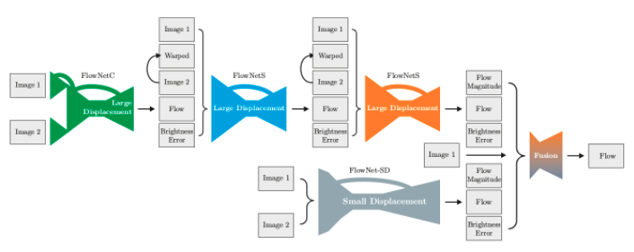

# [FlowNet2](https://arxiv.org/pdf/1709.02371.pdf)
## Evolution of Optical Flow Estimation with Deep Networks

Consists of two previous works FlowNetS and FlowNetC. First net is encoder-decoder network which get features from images, concat them and decode to obtain directed optical flow prediction. Second net takes as input both images directly as 6 channels images and directly predict optical flow. FlowNet2 is just combination of this network in a way that FlowNetC give first predicted flow, then FlowNetS improve it and then another FlowNetS improve then again. Then it combines with predicted flow of another net (same architecture) to obtain final prediction.