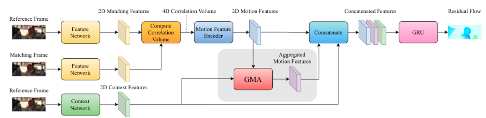
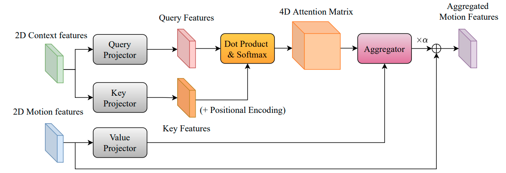

# [GMA](https://arxiv.org/pdf/2104.02409.pdf)
## Learning to Estimate Hidden Motions with Global Motion Aggregation 

Improvement of RAFT networks with attention mechanisms. Motion features encoded using CNN from context frames and then projected to keys and queries for attention. Then it aggregated with values (projected correlation tensor) and feed to GPU as in RAFT.