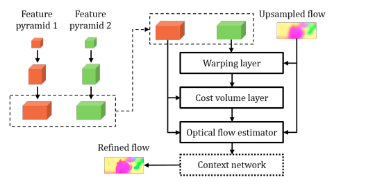

# [PWC](https://arxiv.org/pdf/1709.02371.pdf)
## CNNs for Optical Flow Using Pyramid, Warping, and Cost Volume

This is iterative architecture, where at each iteration we use next level of Feature pyramid network features and previous result of optical flow. 
*Warping* layer is used to wrap features of second image to first: firstly x2 upsample optical flow from previous layer and then use it to move features from second image. 
Cost volume is kind of correlation: just transpose features from first image and multiply to wrapped features2. Then optical flow estimator (CNN net) combines features and optical flow to get updated prediction. After all iterations there are content network to refine optical flow and give final prediction.

Network is quite small and fast, but has poor performance compared to next architectures.