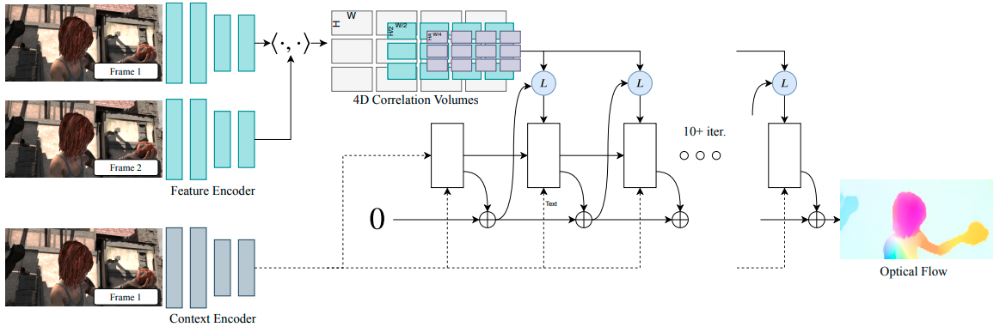

# [RAFT](https://arxiv.org/pdf/2003.12039.pdf)
## Recurrent All Pairs Field Transforms for Optical Flow

Firstly is get features from both images and context from first using usual feature encoder architecture. Then it calculates correlation (dot product) between all features and get WxHxWxH tensor. This tensor will be used in recurrent calculation improvement of flow. At each step this correlation tensor decreases two times to WxHxW/2xH/2. Convolutional GRU use correlation map, context features and prev hidden state to predict delta flow.    